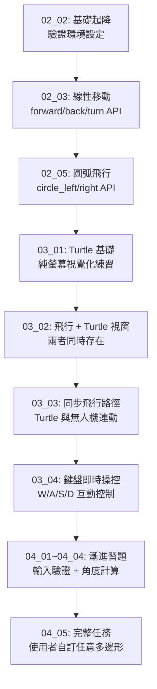

# Crazyflie Python Basics 範例詳細調查報告

本報告基於逐行閱讀原始碼，針對 `crazyflie-python-basics` 資料夾內的每個 Python 範例程式，提供深入的功能解析、程式邏輯說明，以及完整的操作步驟。

> **課程來源**：本套範例為 DroneBlocks 的「Crazyflie Python Basics」教學課程的練習檔案，採循序漸進方式，從基本起降到鍵盤互動控制，最後到使用者自訂形狀飛行任務。

---

## 🛠️ 環境需求與安裝

### 必要套件 (requirements.txt)

| 套件 | 版本 | 用途 |
|:---|:---|:---|
| `cflib` | 0.1.24 | Crazyflie Python 控制函式庫（核心） |
| `cfclient` | 2023.11 | Crazyflie GUI 地面站（可選，用於調試） |
| `numpy` | 1.24.4 | 數值運算 |
| `PyQt6` | 6.6.1 | GUI 框架（cfclient 依賴） |

### 安裝步驟

```bash
# 1. 建立虛擬環境
python3 -m venv venv
source venv/bin/activate  # Linux/macOS
# venv\Scripts\activate   # Windows

# 2. 安裝所有依賴
pip install -r requirements.txt

# 3. 設定 Crazyradio PA USB 權限 (Linux 需要)
sudo groupadd plugdev
sudo usermod -a -G plugdev $USER
# 重新登入或重啟後生效
```

### 連線 URI 格式說明

所有範例都使用以下格式的 URI 連線無人機：
```
radio://0/80/2M/E7E7E7E7E7
   │    │  │  │   └─ 無人機的 Radio Address (5 Bytes Hex)
   │    │  │  └──── 資料速率 (2M = 2Mbps)
   │    │  └─────── 頻道 (80 = Channel 80)
   │    └────────── Dongle 編號 (0 = 第一個 Crazyradio)
   └─────────────── 協定 (radio = Crazyradio)
```

> [!IMPORTANT]
> 執行前請先在 cfclient 中確認您的無人機 URI，並修改腳本中的 `default='radio://0/80/2M/E7E7E7E7E7'` 為您自己的地址。也可以設定環境變數 `CFLIB_URI=radio://0/80/2M/YOURID` 來避免每次修改程式。

---

## 📚 第二章：起飛基礎（Chapter 02）

### 2.1 `02_02_test_take_off_script.py` — 基礎起降測試

**[源碼](file:///home/bill/桌面/klwang/workspace/Bill/crazyflie-python-basics/02_02_test_take_off_script.py)**

#### 功能說明

這是整個課程最基礎的腳本，目的是驗證您的 Crazyradio、cflib 以及 Crazyflie 硬體是否都設定正確。程式會讓無人機起飛到指定高度（0.3m），懸停 3 秒後自動降落。

#### 程式邏輯解析

```python
URI = uri_helper.uri_from_env(default='radio://0/80/2M/E7E7E7E7E7')
DEFAULT_HEIGHT = 0.3  # 預設起飛高度（單位：公尺）

def take_off_simple(scf):
    # 使用 with 語法確保飛行結束後自動降落（即使程式崩潰也會安全降落）
    with MotionCommander(scf, default_height=DEFAULT_HEIGHT) as mc:
        time.sleep(3)   # 懸停 3 秒
        mc.stop()       # 停止並降落

if __name__ == '__main__':
    cflib.crtp.init_drivers()  # 初始化底層 Radio 驅動程式

    with SyncCrazyflie(URI, cf=Crazyflie(rw_cache='./cache')) as scf:
        # SyncCrazyflie 建立同步連線，下載 TOC (Table of Contents)
        # rw_cache='./cache' 表示將 TOC 快取在本地，加快下次連線速度
        print("Getting ready to fly")
        take_off_simple(scf)
        print("Landed safe and sound!")
```

**關鍵概念：`MotionCommander` 的 `with` 語法**
- 進入 `with` 區塊時：自動執行 `takeoff(DEFAULT_HEIGHT)`
- 離開 `with` 區塊時：自動執行 `land()`
- 即使程式在中途拋出例外，也保證安全降落

#### 操作步驟

1. 確認 Crazyradio 已插入電腦 USB，無人機已開機（LED 閃爍表示待機）。
2. 修改腳本中的 URI 以符合您的無人機設定（或設定環境變數）。
3. 在腳本所在目錄執行：
   ```bash
   python3 02_02_test_take_off_script.py
   ```
4. 無人機應起飛至約 30cm 高，懸停 3 秒後降落。
5. 若連線失敗，終端機會顯示錯誤訊息；若成功，最後會印出 `Landed safe and sound!`。

---

### 2.2 `02_03_flying_with_the_motioncommander.py` — 線性移動控制

**[源碼](file:///home/bill/桌面/klwang/workspace/Bill/crazyflie-python-basics/02_03_flying_with_the_motioncommander.py)**

#### 功能說明

示範使用 `MotionCommander` 的各種線性移動 API，讓無人機完成一套連續動作：前進、後退、左轉、右轉、上升、下降。

#### 程式邏輯解析

```python
def move_linear_simple(scf):
    with MotionCommander(scf, default_height=DEFAULT_HEIGHT) as mc:
        time.sleep(0.5)        # 起飛後穩定 0.5 秒

        mc.forward(0.3)        # 前進 0.3 公尺（相對移動）
        time.sleep(0.5)        # 動作之間的緩衝等待

        mc.back(0.3)           # 後退 0.3 公尺
        time.sleep(0.5)

        mc.turn_left(90)       # 左轉 90 度（原地旋轉）
        mc.turn_right(180)     # 右轉 180 度（回正並繼續右轉 90 度）
        time.sleep(0.5)

        mc.right(0.3)          # 向右側飛 0.3 公尺
        time.sleep(0.5)

        mc.up(0.3)             # 上升 0.3 公尺（高度從 0.3 → 0.6m）
        time.sleep(0.5)

        mc.down(0.3)           # 下降 0.3 公尺（回到原始高度）
        time.sleep(0.5)
    # with 區塊結束：自動降落
```

**`MotionCommander` 常用 API 速查表**

| 方法 | 參數 | 說明 |
|:---|:---|:---|
| `forward(d)` | d: 公尺 | 向前飛行 d 公尺 |
| `back(d)` | d: 公尺 | 向後飛行 d 公尺 |
| `left(d)` | d: 公尺 | 向左側飛行 d 公尺 |
| `right(d)` | d: 公尺 | 向右側飛行 d 公尺 |
| `up(d)` | d: 公尺 | 上升 d 公尺 |
| `down(d)` | d: 公尺 | 下降 d 公尺 |
| `turn_left(a)` | a: 角度 | 原地左轉 a 度 |
| `turn_right(a)` | a: 角度 | 原地右轉 a 度 |
| `stop()` | 無 | 懸停並準備降落 |

> [!NOTE]
> 所有移動指令都是**相對移動**，以無人機目前位置/方向為基準，而非全域座標系。每個動作呼叫後，程式會阻塞直到該動作完成，因此不需要手動計算飛行時間。

#### 操作步驟

1. 確保起飛區域至少有 **1×1 公尺**的淨空範圍。
2. 執行：
   ```bash
   python3 02_03_flying_with_the_motioncommander.py
   ```
3. 無人機將依序完成前進→後退→轉向→側飛→上升→下降，最後自動降落。

---

### 2.3 `02_05_crazyflie_circles.py` — 圓形軌跡飛行

**[源碼](file:///home/bill/桌面/klwang/workspace/Bill/crazyflie-python-basics/02_05_crazyflie_circles.py)**

#### 功能說明

讓無人機飛行半圓與完整圓形，示範 `MotionCommander` 的圓弧飛行 API。

#### 程式邏輯解析

```python
def move_circle_simple(scf):
    with MotionCommander(scf, default_height=DEFAULT_HEIGHT) as mc:
        time.sleep(1)  # 起飛後穩定 1 秒

        # circle_left(radius, velocity, angle)
        # 以半徑 0.2m、速度 0.2m/s 逆時針飛行 180 度（半圓）
        mc.circle_left(0.2, 0.2, 180)
        time.sleep(0.5)

        # circle_right(radius) - 以預設速度順時針飛完整圓（360 度，預設值）
        mc.circle_right(0.2)
        time.sleep(0.5)
```

**圓弧飛行 API 說明**

| 方法 | 參數 | 說明 |
|:---|:---|:---|
| `circle_left(r, v, angle)` | r: 半徑(m), v: 速度(m/s), angle: 圓弧角度 | 逆時針圓弧飛行 |
| `circle_right(r, v, angle)` | 同上 | 順時針圓弧飛行，angle 預設 360（完整圓） |

> [!WARNING]
> 此腳本需要至少 **1 × 1 公尺**的飛行空間（半徑 0.2m 的圓，加上無人機本身的緩衝距離）。請確認飛行區域淨空後再執行。

#### 操作步驟

1. 確保飛行場地足夠（直徑至少 0.5m 以上的淨空）。
2. 執行：
   ```bash
   python3 02_05_crazyflie_circles.py
   ```
3. 無人機起飛後懸停 1 秒，接著逆時針飛半圓，停頓後順時針飛完整圓，最後降落。

---

## 🐢 第三章：Turtle 視覺化（Chapter 03）

本章引入了 Python 內建的 `turtle` 繪圖模組，在電腦螢幕上以視覺化方式模擬無人機的飛行軌跡，讓使用者能在螢幕上預覽並監控飛行路徑。

---

### 3.1 `03_01_turtle_basics.py` — Turtle 繪圖入門

**[源碼](file:///home/bill/桌面/klwang/workspace/Bill/crazyflie-python-basics/03_01_turtle_basics.py)**

#### 功能說明

這是一個純電腦端的 Turtle 繪圖練習，**不連接無人機**。目的是讓學習者熟悉 `turtle` 模組的基本指令，作為後續結合無人機飛行的基礎。

#### 程式邏輯解析

```python
from turtle import Turtle, Screen

screen = Screen()               # 建立 Turtle 繪圖視窗
donatello = Turtle(shape="turtle")  # 建立名為 donatello 的 Turtle 物件，外形為烏龜
donatello.shapesize(2)          # 將烏龜圖示放大 2 倍
donatello.pensize(5)            # 畫線寬度設為 5px
donatello.speed(1)              # 移動速度（1=最慢，10=最快）

# 移動指令
donatello.forward(100)          # 向前畫 100 單位
donatello.left(90)              # 左轉 90 度
donatello.forward(100)          # 再前進 100 單位
donatello.right(90)             # 右轉 90 度
donatello.forward(200)          # 再前進 200 單位

screen.exitonclick()            # 等待使用者點擊視窗後才關閉
```

**Turtle 指令與無人機指令對照表**

| Turtle 指令 | 對應的無人機指令 |
|:---|:---|
| `forward(100)` | `mc.forward(1.0)` (100 Turtle 單位 ≈ 1m) |
| `backward(100)` | `mc.back(1.0)` |
| `left(90)` | `mc.turn_left(90)` |
| `right(90)` | `mc.turn_right(90)` |

#### 操作步驟

1. 此腳本**不需要**無人機或 Crazyradio。
2. 直接執行：
   ```bash
   python3 03_01_turtle_basics.py
   ```
3. 螢幕會出現 Turtle 視窗，並自動繪製一段折線路徑。點擊視窗關閉程式。

---

### 3.2 `03_02_flying_turtle.py` — 起飛並同步顯示 Turtle 視窗

**[源碼](file:///home/bill/桌面/klwang/workspace/Bill/crazyflie-python-basics/03_02_flying_turtle.py)**

#### 功能說明

連接無人機後，同時建立 Turtle 視窗。這是一個過渡性範例：無人機會起飛並懸停，Turtle 視窗也隨之開啟，展示「無人機飛行 + Turtle 視覺化同時存在」的架構，但此版本尚未將兩者的動作連動。

#### 程式邏輯解析

```python
def flying_turtle(scf):
    with MotionCommander(scf, default_height=DEFAULT_HEIGHT) as mc:
        # 在無人機懸停中，建立 Turtle 視窗
        screen = Screen()
        donatello = Turtle(shape="turtle")
        donatello.shapesize(2)
        donatello.pensize(5)
        donatello.speed(1)

        # 等待使用者點擊視窗 → 點擊後 with 區塊結束 → 無人機降落
        screen.exitonclick()
```

> [!NOTE]
> 此版本中，Turtle 的圖示只是靜止在螢幕中央，並不會移動。無人機也只是懸停。點擊 Turtle 視窗的任意位置，程式才會結束，無人機才會降落。

#### 操作步驟

1. 確認無人機連線 URI 正確。
2. 執行：
   ```bash
   python3 03_02_flying_turtle.py
   ```
3. 無人機起飛並懸停，電腦螢幕同時出現 Turtle 視窗。
4. **點擊 Turtle 視窗**任意位置，程式結束，無人機降落。

---

### 3.3 `03_03_turtle_square_mission.py` — Turtle 與無人機同步飛正方形

**[源碼](file:///home/bill/桌面/klwang/workspace/Bill/crazyflie-python-basics/03_03_turtle_square_mission.py)**

#### 功能說明

這是本章的核心範例。無人機執行正方形飛行任務（4 個邊，每邊 0.5m），同時 Turtle 在螢幕上同步繪製完全相同的正方形軌跡，讓使用者在電腦上即時看到飛行路徑。

#### 程式邏輯解析

```python
def flying_turtle(scf):
    with MotionCommander(scf, default_height=DEFAULT_HEIGHT) as mc:
        screen = Screen()
        donatello = Turtle(shape="turtle")
        donatello.shapesize(2)
        donatello.pensize(5)
        donatello.speed(1)

        # 重複 4 次 → 飛出正方形
        for _ in range(4):
            donatello.forward(150)    # Turtle 在螢幕上前進 150 單位
            mc.forward(0.5)           # 無人機同時向前飛 0.5 公尺

            donatello.left(90)        # Turtle 左轉 90 度
            mc.turn_left(90)          # 無人機同時左轉 90 度

        screen.exitonclick()          # 完成後等待點擊關閉
```

**飛行路徑示意：**
```
起點 ──0.5m→ ┐
             ↓ 0.5m
             ┘ ──0.5m→ ┐
                        ↓ 0.5m
                   起點 ←0.5m──┘
```

#### 操作步驟

1. 確保飛行場地至少有 **0.6 × 0.6 公尺**的淨空（邊長 0.5m + 緩衝）。
2. 執行：
   ```bash
   python3 03_03_turtle_square_mission.py
   ```
3. 無人機起飛，並與 Turtle 同步完成正方形飛行。Turtle 視窗中可即時看到飛行路徑被描繪出來。
4. 飛行完畢後點擊 Turtle 視窗，無人機降落。

---

### 3.4 `03_04_crazyflie_turtle_control.py` — 鍵盤即時操控無人機（含路徑可視化）

**[源碼](file:///home/bill/桌面/klwang/workspace/Bill/crazyflie-python-basics/03_04_crazyflie_turtle_control.py)**

#### 功能說明

本系列中最互動性的範例。使用 Turtle 視窗的鍵盤事件監聽機制，實現以鍵盤 `W/A/S/D` 即時操控無人機前後左右移動，同時 Turtle 在螢幕上同步繪製真實飛行路徑。

#### 程式邏輯解析

```python
TURTLE_DISTANCE = 50    # 每次按鍵，Turtle 移動 50 個畫素
CRAZYFLIE_DISTANCE = 0.1  # 每次按鍵，無人機移動 0.1 公尺 (10cm)
TURN_ANGLE = 10         # 每次按鍵，轉向 10 度

def turtle_power(scf):
    with MotionCommander(scf, default_height=DEFAULT_HEIGHT) as mc:
        screen = Screen()
        donatello = Turtle(shape="turtle")
        # ... 初始化設定 ...

        # 定義各動作函式（閉包，能存取 mc 和 donatello）
        def move_forward():
            donatello.forward(TURTLE_DISTANCE)
            mc.forward(CRAZYFLIE_DISTANCE)

        def move_backward():
            donatello.backward(TURTLE_DISTANCE)
            mc.back(CRAZYFLIE_DISTANCE)

        def turn_left():
            donatello.left(TURN_ANGLE)
            mc.turn_left(TURN_ANGLE)

        def turn_right():
            donatello.right(TURN_ANGLE)
            mc.turn_right(TURN_ANGLE)

        def close_screen():
            screen.bye()  # 關閉視窗 → 退出迴圈 → 自動降落

        # 將鍵盤按鍵綁定到對應函式
        screen.listen()               # 開始監聽鍵盤事件
        screen.onkey(key="w", fun=move_forward)
        screen.onkey(key="s", fun=move_backward)
        screen.onkey(key="a", fun=turn_left)
        screen.onkey(key="d", fun=turn_right)
        screen.onkey(key="q", fun=close_screen)  # 按 Q 安全降落並退出

        screen.exitonclick()          # 保持視窗開啟（也可按 Q 退出）
```

**按鍵對照表**

| 按鍵 | 動作 | 無人機移動量 |
|:---:|:---|:---|
| `W` | 向前飛 | 0.1 公尺 |
| `S` | 向後飛 | 0.1 公尺 |
| `A` | 向左轉 | 10 度 |
| `D` | 向右轉 | 10 度 |
| `Q` | 安全降落並退出 | - |
| 點擊視窗 | 安全降落並退出 | - |

> [!IMPORTANT]
> 每次按鍵後無人機會執行該段移動並停止（非連續飛行）。Turtle 視窗**必須是焦點視窗**（即使用者點擊過它），鍵盤監聽才會生效。

#### 操作步驟

1. 確保飛行場地寬敞（建議 2×2 公尺以上），並有人在旁監控。
2. 執行：
   ```bash
   python3 03_04_crazyflie_turtle_control.py
   ```
3. 無人機起飛，Turtle 視窗開啟。
4. **點擊一下 Turtle 視窗**使其獲得鍵盤焦點。
5. 使用 `W/A/S/D` 操控無人機，Turtle 會同步繪製路徑。
6. 按 `Q` 或點擊視窗任意位置結束飛行，無人機安全降落。

---

## 🎯 第四章：自訂形狀飛行任務（Chapter 04）

本章以漸進式的習題方式（`04_01` 到 `04_04` 為練習版，`04_05` 為完整版），帶領學習者實作一個能讓無人機飛出任意多邊形的程式，邊數與邊長均由使用者在終端機輸入。

---

### 4.1 `04_01_move_in_user_defined_shape_exercise.py` — 習題第一階段：框架建立

**[源碼](file:///home/bill/桌面/klwang/workspace/Bill/crazyflie-python-basics/04_01_move_in_user_defined_shape_exercise.py)**

#### 功能說明

提供最基本的腳本框架，`move_in_user_defined_shape` 函式存在但內部幾乎是空的。這是第一個學習階段，要求學習者思考整個程式的架構。

#### 程式邏輯（目前狀態）

```python
# TODO: #2 CREATE FUNCTION THAT ASKS FOR INPUT AND ONLY ACCEPTS INTEGER 

def move_in_user_defined_shape(scf):
    # TODO: #3 TAKE USER_INPUT AND CALCULATE TURN_LEFT ANGLE FOR INTERIOR ANGLE OF SHAPE
    
    with MotionCommander(scf, default_height=DEFAULT_HEIGHT) as mc:
        time.sleep(1)
        # TODO: #4 FLY FORWARD, SLEEP, TURN_LEFT(X) FOR EACH SIDE OF SHAPE      
        time.sleep(0.5)

# TODO: #5 ADD COMMENTS TO CODE
```

此腳本直接執行**不會讓無人機飛行任何形狀**，只會起飛後立即降落。目的是讓學習者在空白處填入邏輯。

---

### 4.2 `04_02_move_in_user_defined_shape_exercise.py` — 習題第二階段：輸入函式

**[源碼](file:///home/bill/桌面/klwang/workspace/Bill/crazyflie-python-basics/04_02_move_in_user_defined_shape_exercise.py)**

#### 功能說明

加入了輸入驗證函式 `get_integer_input()`，並在全域作用域呼叫它取得使用者輸入，但飛行函式本身仍為 TODO 狀態（已被註解掉）。

#### 新增的程式邏輯

```python
def get_integer_input(prompt):
    """
    反覆要求使用者輸入，直到輸入值可成功轉為整數為止。
    使用 try/except 處理非整數輸入的 ValueError。
    """
    while True:
        try:
            value = int(input(prompt))
            return value
        except ValueError:
            print("Whoops, that's not a whole number, please enter an integer.")

# 在全域呼叫（程式啟動時就詢問，但尚未整合到飛行函式中）
number_of_sides = get_integer_input("Enter in the number of sides of shape: ")
side_length = get_integer_input("Enter in the length of sides in CM: ")
```

---

### 4.3 `04_03_move_in_user_defined_shape_exercise.py` — 習題第三階段：角度計算

**[源碼](file:///home/bill/桌面/klwang/workspace/Bill/crazyflie-python-basics/04_03_move_in_user_defined_shape_exercise.py)**

#### 功能說明

在第二階段的基礎上，飛行函式已恢復（取消部分註解），加入了**轉角計算公式**，但飛行的迴圈本體仍為 TODO。

#### 新增的程式邏輯

```python
# 注意：side_length 在這裡做了單位換算（公分 → 公尺）
side_length = get_integer_input("Enter in the length of sides in CM: ") / 100

def move_in_user_defined_shape(scf):
    # 關鍵公式：正多邊形每個外角 = 360° / 邊數
    # 例如：正方形（4邊）→ 360/4 = 90°
    # 正六邊形（6邊）→ 360/6 = 60°
    turn_left = 360 / number_of_sides

    with MotionCommander(scf, default_height=DEFAULT_HEIGHT) as mc:
        time.sleep(1)
        # TODO: #4 FLY FORWARD, SLEEP, TURN_LEFT(X) FOR EACH SIDE OF SHAPE  
        time.sleep(0.5)
```

---

### 4.4 `04_04_move_in_user_defined_shape_exercise.py` — 習題第四階段：輸入整合進函式

**[源碼](file:///home/bill/桌面/klwang/workspace/Bill/crazyflie-python-basics/04_04_move_in_user_defined_shape_exercise.py)**

#### 功能說明

將使用者輸入的呼叫**移入飛行函式內部**（更好的封裝設計），角度計算也保留，但飛行迴圈仍是 TODO。

#### 程式重構邏輯

```python
def move_in_user_defined_shape(scf):
    # 輸入驗證現在封裝在函式內部（比全域呼叫更好）
    number_of_sides = get_integer_input("Enter in the number of sides of shape: ")
    side_length = get_integer_input("Enter in the length of sides in CM: ") / 100
    turn_left = 360 / number_of_sides

    with MotionCommander(scf, default_height=DEFAULT_HEIGHT) as mc:
        time.sleep(1)
        for _ in range(number_of_sides):
            print("Flying Forward...")
            mc.forward(side_length)
            time.sleep(0.5)
            print("Turning In Progress...")
            mc.turn_left(turn_left)  # ← 飛行迴圈已實作（TODO #4 完成）
            time.sleep(0.5)
```

> [!NOTE]
> `04_04` 實際上**已經可以完整執行**飛行任務，只是還有 `# TODO: #5 ADD COMMENTS TO CODE` 的提示，要求學習者補上程式碼注釋。

---

### 4.5 `04_05_move_in_user_defined_shape_complete.py` — 完整版：任意多邊形飛行

**[源碼](file:///home/bill/桌面/klwang/workspace/Bill/crazyflie-python-basics/04_05_move_in_user_defined_shape_complete.py)**

#### 功能說明

本章的最終完整版本，程式碼與 `04_04` 在邏輯上完全相同（TODO 已全部完成），是整個課程的集大成之作。使用者輸入邊數與邊長後，無人機會精確地飛出對應的正多邊形。

#### 完整程式邏輯解析

```python
def get_integer_input(prompt):
    """要求使用者輸入整數，含錯誤處理，直到成功為止。"""
    while True:
        try:
            value = int(input(prompt))
            return value
        except ValueError:
            print("Whoops, that's not a whole number, please enter an integer.")


def move_in_user_defined_shape(scf):
    """
    根據使用者輸入的邊數和邊長，讓無人機飛出對應的正多邊形。
    
    核心數學原理：
    - 正多邊形的每個外角 = 360° / 邊數
    - 飛完一個邊後左轉這個角度，重複「邊數」次，即可回到起點
    """
    # Step 1: 獲取使用者輸入
    number_of_sides = get_integer_input("Enter in the number of sides of shape: ")
    side_length = get_integer_input("Enter in the length of sides in CM: ") / 100  # cm → m

    # Step 2: 計算每邊轉角
    turn_left = 360 / number_of_sides

    # Step 3: 執行飛行
    with MotionCommander(scf, default_height=DEFAULT_HEIGHT) as mc:
        time.sleep(1)  # 起飛穩定等待
        
        for _ in range(number_of_sides):
            print("Flying Forward...")
            mc.forward(side_length)    # 飛行一個邊
            time.sleep(0.5)
            
            print("Turning In Progress...")
            mc.turn_left(turn_left)    # 轉到下一個邊的方向
            time.sleep(0.5)
    # 迴圈結束 → with 區塊退出 → 自動降落


if __name__ == '__main__':
    cflib.crtp.init_drivers()
    with SyncCrazyflie(URI, cf=Crazyflie(rw_cache='./cache')) as scf:
        move_in_user_defined_shape(scf)
```

**飛行形狀與轉角對照表（數學驗證）**

| 使用者輸入邊數 | 計算轉角 | 飛出的形狀 |
|:---:|:---:|:---|
| 3 | 360/3 = **120°** | 正三角形 |
| 4 | 360/4 = **90°** | 正方形 |
| 5 | 360/5 = **72°** | 正五邊形 |
| 6 | 360/6 = **60°** | 正六邊形 |
| 8 | 360/8 = **45°** | 正八邊形（接近圓形） |

#### 完整操作步驟

1. 確認無人機已開機，Crazyradio 已插入，URI 已設定正確。
2. 計算所需飛行空間：飛行面積約為 `邊長 × 1.5 倍` 的正方形範圍。
3. 執行腳本：
   ```bash
   python3 04_05_move_in_user_defined_shape_complete.py
   ```
4. 終端機會詢問：
   ```
   Enter in the number of sides of shape: 4      ← 輸入邊數（例如 4 = 正方形）
   Enter in the length of sides in CM: 50        ← 輸入邊長（公分，例如 50cm = 0.5m）
   ```
5. 輸入完成後，腳本立即連線並讓無人機起飛，執行飛行任務。
6. 終端機依序印出：
   ```
   Flying Forward...
   Turning In Progress...
   （重複 N 次）
   ```
7. 所有邊飛完後，無人機自動降落。

---

## 📊 課程學習路徑總覽



> **總結**：此課程從最基礎的環境驗證（起降）出發，逐步加入移動控制、視覺化路徑追蹤、鍵盤互動，最終實作一個可由使用者完全自訂的多邊形飛行任務，完整涵蓋了 `cflib` + `MotionCommander` 的核心使用方法。
